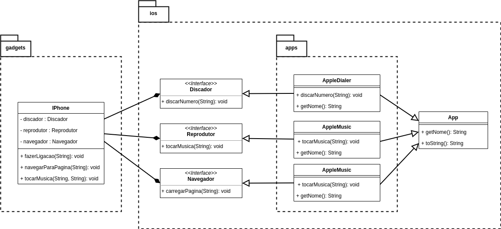

<h1>
    
     Projeto final de POO em Java
</h1>

Repositório contendo códigos do projeto representando funcionamento do dispositivo iPhone.

## Objetivo
Demonstrar habilidades de programação orientada a objetos utilizando a linguagem de programação Java.

## Diagrama de modelo

